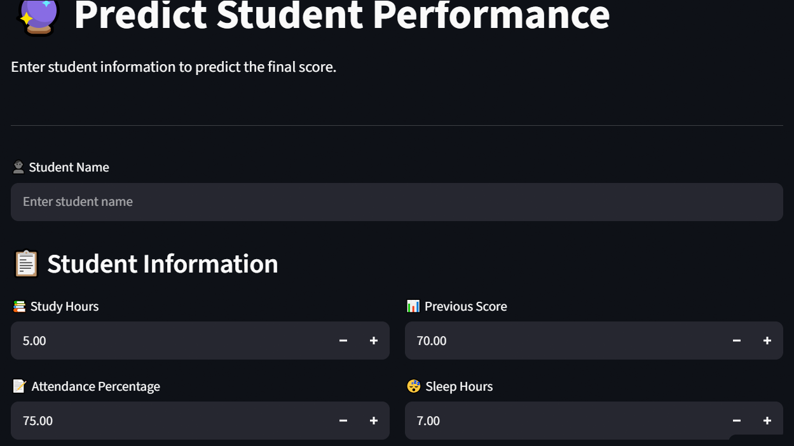
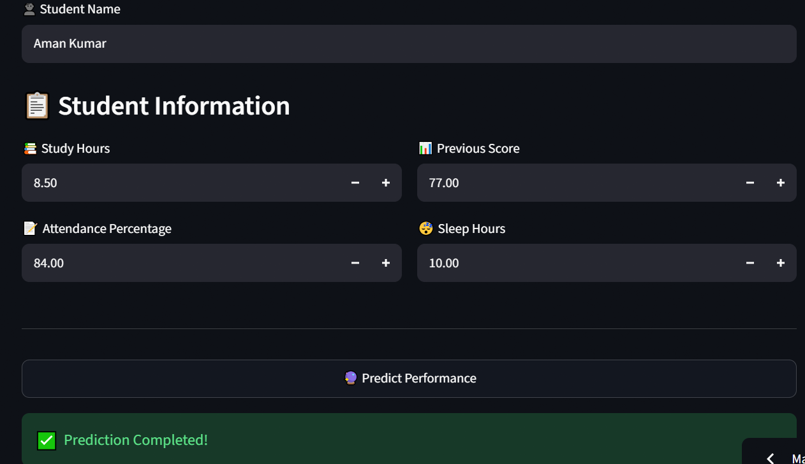
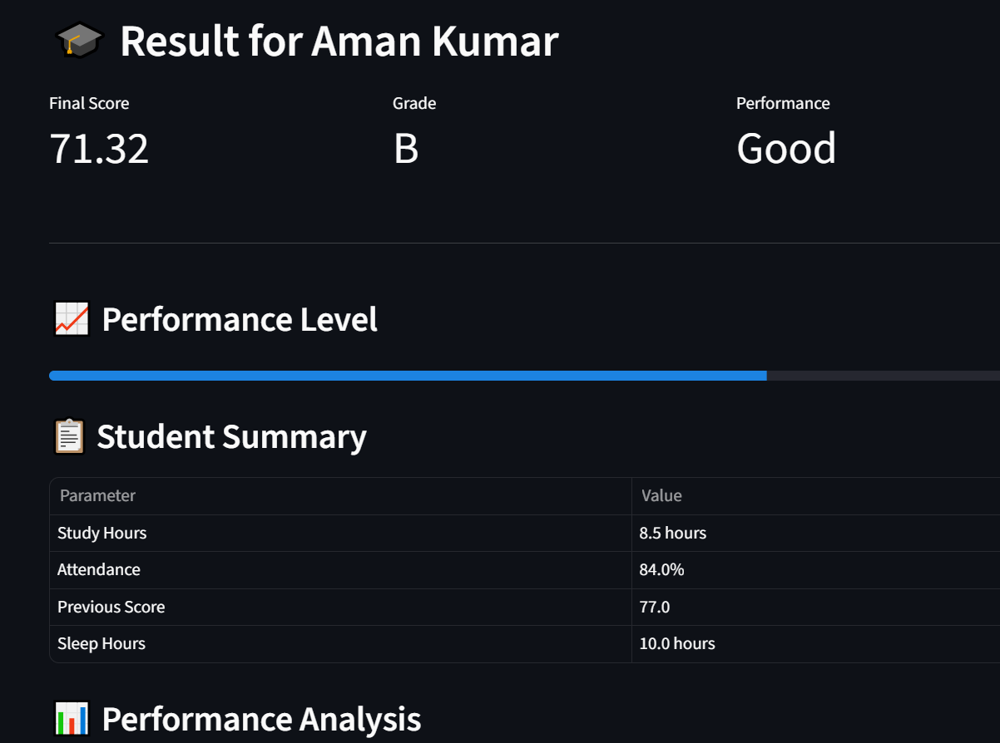
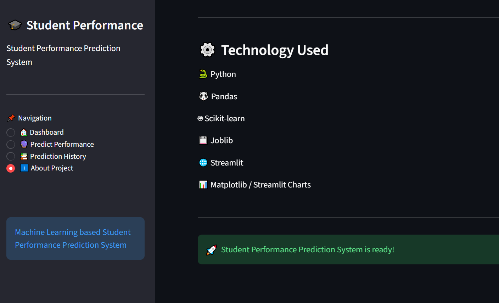

# 🎓 Student Performance Prediction System

A Machine Learning based web application that predicts student academic performance using study hours, attendance, previous score, and sleep hours.

The application is developed using Python, Machine Learning, Pandas, Scikit-learn and Streamlit.

---

## 📌 Project Overview

The Student Performance Prediction System is designed to help analyze and predict a student's academic performance based on important academic and lifestyle factors.

The system takes the following inputs:

- Student Name
- Study Hours
- Attendance Percentage
- Previous Score
- Sleep Hours

Based on these inputs, the trained Machine Learning model predicts the student's performance score.

---

## 🚀 Features

- 📊 Interactive Dashboard
- 🎯 Student Performance Prediction
- 📈 Model Performance Analysis
- 📝 Prediction History
- 📥 Download Prediction History
- 📊 Performance Charts
- 💡 Personalized Recommendations
- 🎓 Student Academic Analysis
- 🌐 Streamlit Web Interface

---

## 🛠️ Technologies Used

### Programming Language
- Python

### Libraries
- Pandas
- NumPy
- Scikit-learn
- Joblib
- Matplotlib
- Streamlit

### Machine Learning
- Regression-based prediction
- Model evaluation using:
  - MAE
  - RMSE
  - R² Score

---

## 📂 Project Structure

```text
Student Performance Prediction/
│
├── app.py
├── generate_dataset.py
├── requirements.txt
├── README.md
├── .gitignore
│
├── dataset/
│   └── student_data.csv
│
├── models/
│   └── best_student_model.pkl
│
├── notebooks/
│
└── reports/
    ├── model_comparison.csv
    └── prediction_history.csv

    ## 🌐 Live Demo

Try the application online:

https://studentperformance-predict.streamlit.app/

---

## 📸 Project Screenshots

### 🏠 Dashboard

The dashboard provides an overview of the Student Performance Prediction System, including model performance metrics, prediction statistics, and visualizations.


---

### 🔮 Student Performance Prediction

The prediction module allows users to enter student information such as study hours, attendance, previous score, and sleep hours to predict the expected performance score.







---

### 📚 Prediction History

The prediction history section stores previous predictions and provides useful statistics and visualizations.


---

### 📋 Project Overview



---